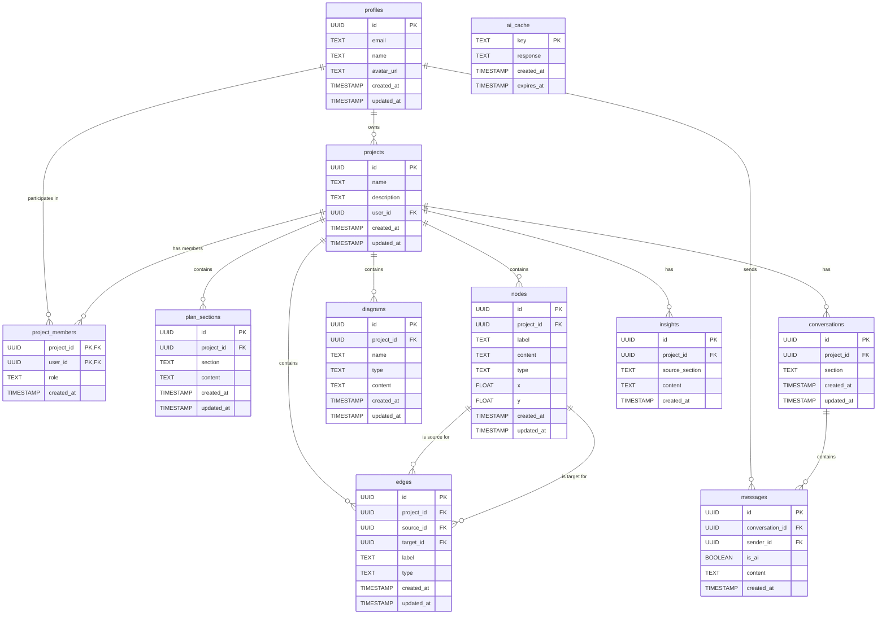

# 8gentc Database Schema Documentation

## Overview
This document describes the database schema for the 8gentc platform, a collaborative business planning application with AI integration. The schema is designed to support user authentication, project management, plan creation, visualizations, and AI-assisted conversations.

## Entity-Relationship Diagram

## Table Definitions

### profiles
Extends the Supabase auth.users table, storing additional user information.
- **id**: UUID (PK) - References auth.users
- **email**: TEXT (UNIQUE) - User's email address
- **name**: TEXT - User's display name
- **avatar_url**: TEXT - URL to user's profile image
- **created_at**: TIMESTAMP - When the profile was created
- **updated_at**: TIMESTAMP - When the profile was last updated

### projects
Main project container for business plans.
- **id**: UUID (PK) - Unique identifier
- **name**: TEXT - Project name
- **description**: TEXT - Project description
- **user_id**: UUID (FK) - References profiles(id), the project owner
- **created_at**: TIMESTAMP - When the project was created
- **updated_at**: TIMESTAMP - When the project was last updated

### project_members
Junction table for future collaboration features.
- **project_id**: UUID (PK, FK) - References projects(id)
- **user_id**: UUID (PK, FK) - References profiles(id)
- **role**: TEXT - Member's role (default: 'member')
- **created_at**: TIMESTAMP - When the member was added

### plan_sections
Stores different sections of a business plan.
- **id**: UUID (PK) - Unique identifier
- **project_id**: UUID (FK) - References projects(id)
- **section**: TEXT - Name of the section (e.g., 'Context', 'Goals', 'Timeline')
- **content**: TEXT - Content of the section
- **created_at**: TIMESTAMP - When the section was created
- **updated_at**: TIMESTAMP - When the section was last updated

### nodes
Stores nodes for graph visualizations.
- **id**: UUID (PK) - Unique identifier
- **project_id**: UUID (FK) - References projects(id)
- **label**: TEXT - Node label
- **content**: TEXT - Node content or description
- **type**: TEXT - Node type (e.g., 'concept', 'task', 'goal')
- **x**: FLOAT - X coordinate for visualization
- **y**: FLOAT - Y coordinate for visualization
- **created_at**: TIMESTAMP - When the node was created
- **updated_at**: TIMESTAMP - When the node was last updated

### edges
Stores connections between nodes in graph visualizations.
- **id**: UUID (PK) - Unique identifier
- **project_id**: UUID (FK) - References projects(id)
- **source_id**: UUID (FK) - References nodes(id), origin of the edge
- **target_id**: UUID (FK) - References nodes(id), destination of the edge
- **label**: TEXT - Edge label
- **type**: TEXT - Edge type (e.g., 'dependency', 'relates-to')
- **created_at**: TIMESTAMP - When the edge was created
- **updated_at**: TIMESTAMP - When the edge was last updated

### diagrams
Stores Mermaid diagrams and other visualizations.
- **id**: UUID (PK) - Unique identifier
- **project_id**: UUID (FK) - References projects(id)
- **name**: TEXT - Diagram name
- **type**: TEXT - Diagram type (e.g., 'mermaid', 'flowchart')
- **content**: TEXT - The diagram code or data
- **created_at**: TIMESTAMP - When the diagram was created
- **updated_at**: TIMESTAMP - When the diagram was last updated

### conversations
Stores chat conversations for different project sections.
- **id**: UUID (PK) - Unique identifier
- **project_id**: UUID (FK) - References projects(id)
- **section**: TEXT - Which section this conversation belongs to
- **created_at**: TIMESTAMP - When the conversation was created
- **updated_at**: TIMESTAMP - When the conversation was last updated

### messages
Stores chat messages within conversations.
- **id**: UUID (PK) - Unique identifier
- **conversation_id**: UUID (FK) - References conversations(id)
- **sender_id**: UUID (FK) - References profiles(id), null if system message
- **is_ai**: BOOLEAN - Whether the message is from the AI assistant
- **content**: TEXT - Message content
- **created_at**: TIMESTAMP - When the message was sent

### ai_cache
Caches AI responses for performance optimization.
- **key**: TEXT (PK) - Cache key
- **response**: TEXT - Cached AI response
- **created_at**: TIMESTAMP - When the cache entry was created
- **expires_at**: TIMESTAMP - When the cache entry expires

### insights
Stores insights generated from different sections to be shared across the project.
- **id**: UUID (PK) - Unique identifier
- **project_id**: UUID (FK) - References projects(id)
- **source_section**: TEXT - Which section generated this insight
- **content**: TEXT - Insight content
- **created_at**: TIMESTAMP - When the insight was created

## Row Level Security (RLS) Policies

All tables have Row Level Security enabled with appropriate policies ensuring:
- Users can only see and modify their own projects
- Project members can view and edit shared projects
- Profile information is protected
- AI cache can be read by authenticated users but only written by system processes

## Performance Considerations

1. **Indexes**: Primary keys are automatically indexed
2. **Constraints**: Proper foreign key constraints ensure data integrity
3. **Triggers**: Automatic updating of `updated_at` timestamps
4. **Default Values**: Sensible defaults are provided where appropriate
5. **UUID Generation**: Uses uuid-ossp extension for ID generation

## Database Extensions
- uuid-ossp: For UUID generation

## Triggers
Triggers are set up on all tables with an updated_at column to automatically update the timestamp when rows are modified. 